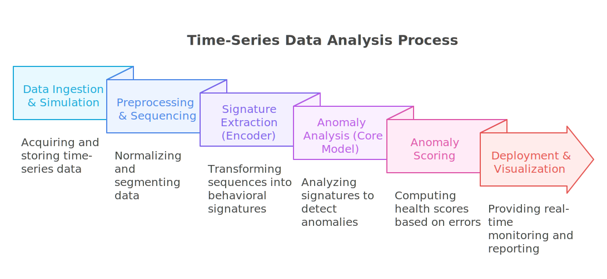

=======================================================
Introduction to Project Sigma: Intelligent Monitoring of Robotic Systems
=======================================================

Sigma is an advanced predictive maintenance system designed to ensure the reliability of automated industrial processes. Leveraging cutting-edge artificial intelligence techniques, Sigma learns the normal behavior of robotic systems in order to detect faults and degradation well before they become critical.

Context and Vision
==================

In the Industry 4.0 era, even brief production downtimes can result in significant costs. Traditional predictive maintenance often relies on static rules or sensor thresholds—methods that fail to capture complex system dynamics or early signs of failure.

Project Sigma proposes a paradigm shift. Instead of monitoring isolated sensor values, it builds and analyzes a behavioral digital signature for each machine. This signature is a compact, information-rich representation of a system’s normal operation, capturing subtle interactions between its components.

Our solution is tailored for maintenance engineers, production managers, and data scientists, offering them a smart, lightweight, and interpretable tool for industrial asset health monitoring.

Technical and Strategic Objectives
==================================

Sigma is designed to meet the following key goals:

- **Deep Representation Learning**: Design and train deep learning models (LSTM autoencoders, CNNs) to extract meaningful behavioral signatures from raw time-series data.

- **Multi-Faceted Anomaly Detection**: Build a robust detection system based on both reconstruction error (current state consistency) and prediction error (future state anticipation) for earlier failure detection.

- **Systematic Benchmarking**: Evaluate the performance of our signature-based approach against traditional anomaly detection algorithms (e.g., Isolation Forest, One-Class SVM) to quantify its added value.

- **Intuitive Human-Machine Interface**: Deploy the solution via an interactive Streamlit dashboard for real-time monitoring, assisted diagnostics, and automated reporting.

Pipeline Architecture
=====================

Our pipeline is designed to transform raw sensor data into actionable health insights through **six structured stages**, as illustrated below.

The end-to-end process consists of:

1. **Data Ingestion & Simulation**  
   Realistic time-series data is generated using **RoboDK simulations** and collected via its API. The raw data is stored in CSV or Parquet format, ensuring high-fidelity and reproducibility.

2. **Preprocessing & Sequencing**  
   The signals are normalized and smoothed to remove irrelevant noise. Then, using a sliding window approach, they are segmented into fixed-length temporal sequences for modeling.

3. **Signature Extraction (Encoder)**  
   A pre-trained **LSTM Autoencoder** acts as a feature extractor, compressing each temporal sequence into a compact and expressive **8-dimensional behavioral signature**. This forms the foundation of our transfer learning strategy.

4. **Anomaly Analysis (Core Model)**  
   A **dual-head CNN-BiLSTM model** processes the extracted signatures to both **reconstruct** the input and **predict** its next state. This dual-task approach provides a comprehensive view of system behavior.

5. **Anomaly Scoring**  
   An anomaly score is computed by combining the reconstruction error and prediction error. This score serves as a robust and sensitive health indicator of the system’s condition.

6. **Deployment & Visualization**  
   The entire pipeline is deployed through an interactive **Streamlit dashboard**, enabling real-time monitoring, dynamic anomaly thresholding, and automated diagnostics and reporting.

.. note::

   Detailed explanations of the model architectures, comparative benchmarks (e.g., against Isolation Forest), and our hyperparameter optimization strategy are provided in the **Methodology and Models** section.

.. note::

   The entire project — including source code, RoboDK simulations, pre-trained models, and experimentation notebooks — is available on our GitHub repository.

🔗 Check out the project on GitHub: `sigma-industrial-ai <https://github.com/MerlinMaven/sigma-industrial-ai.git>`_

Project Structure
=================

The following tree illustrates the structure of the Sigma project repository. It includes multiple simulation files, trained models, and time series data files.

.. code-block:: text

   sigma-industrial-ai/
   ├── data/
   │   ├── simulated_data/
   │   │   ├── Linear_Rail_rail_data.csv
   │   │   └── ... (additional simulated CSV files)
   │   └── simulations/
   │       ├── simulation.rdk
   │       └── ... (additional RoboDK simulation files)
   ├── models/
   │   ├── saved_models/
   │   │   ├── LSTM_AE_bottleneck_8.h5
   │   │   └── ... (other single-output models)
   │   └── saved_dual_output_models/
   │       ├── CNN_BILSTM_AE_v1.h5
   │       └── ... (other dual-output architectures)
   ├── notebooks/
   │   ├── data_collection.ipynb
   │   ├── Linear_Rail.ipynb
   │   └── ... (additional experiments and evaluation notebooks)
   ├── src/
   │   ├── pipeline.py
   │   └── dashboard.py
   ├── requirements.txt
   └── README.md
