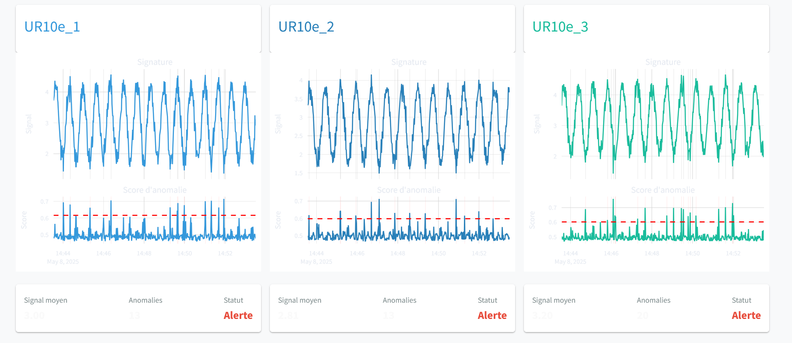
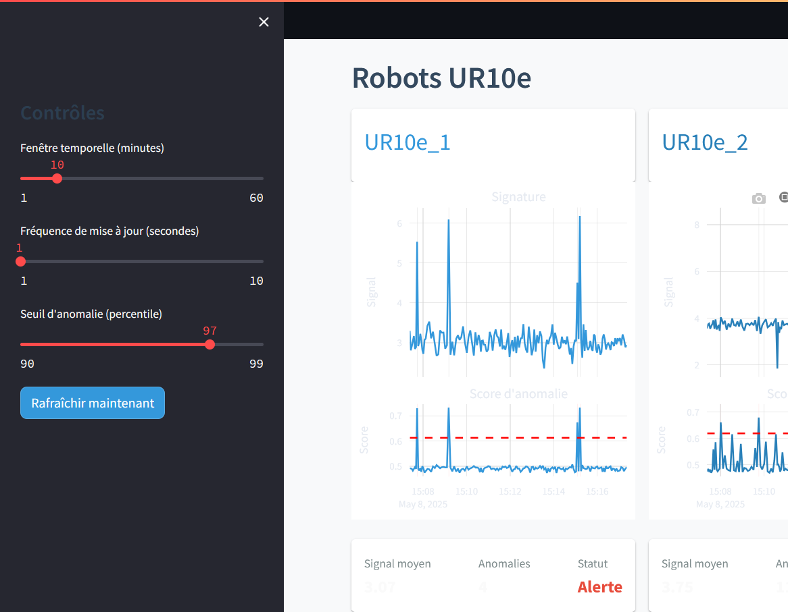

Deployment and Interface
=================================================

Final Step of the Pipeline: Deployment
--------------------------------------

Once the analysis and prediction models have been built, the final step of our pipeline is to **deploy the system** to make it accessible to end users (engineers, operators, technicians).

The application is based on Streamlit, chosen for its following advantages:

Why Streamlit?
~~~~~~~~~~~~~~~~

- ✔️ **Simplicity**: rapid development with minimal code
- ✔️ **Customization**: interactive and adaptable interface
- ✔️ **Direct integration** with Python notebooks and scripts
- ✔️ **Real-time updates** ideal for continuous signals

.. note::
   **Streamlit** is an open-source Python framework for creating interactive web applications for data science and machine learning, without requiring web development knowledge.

Interface Components
--------------------

The Streamlit interface developed provides a **comprehensive visualization of the Sigma-RUL system**:

1. **Digital signatures** of components (robots, conveyors, rail)
2. **Reconstructed series and future predictions** by the LSTM autoencoders
3. **Anomaly score** visualized with an adjustable threshold
4. **Reconstruction and prediction errors**
5. **Dynamic RUL estimation** (Remaining Useful Life)
6. **Component status**: a dynamic text alert indicates the current status:

   - 🟢 **Normal**: operating within normal thresholds
   - 🟡 **Warning**: beginning deviation or suspicious behavior
   - 🔴 **Alert**: confirmed anomaly or very low RUL

.. note::
   This status is automatically updated based on the anomaly score and RUL estimation.

.. hint::
   The interface allows for immediate diagnosis of each component's behavior with dynamically updated graphs.

Monitored Components
~~~~~~~~~~~~~~~~~~~~~~

- 🤖 3 x UR10e Robots: Robot1, Robot2, Robot3
- 🛤️ Moving Rail
- 📦 Box Conveyor (Conveyor_Box)
- 🍾 Bottle Conveyor (Conveyor_Bottle)

Local Deployment vs. Online Version
-----------------------------------

.. important::
   This application collects **real-time data from RoboDK**, a software installed locally. To ensure proper data collection and analysis, **the application must be run locally** on the same machine as RoboDK.

.. note::
   For demonstration purposes, an **online version** of the application has also been developed. It relies on **pre-recorded data** and illustrates the analysis and visualization functionalities of the system.

👉 Link to the demo version: https://sigma-rul-demo.streamlit.app

Interface Preview
------------------

Here’s a preview of the Streamlit application:

Interactive Controls
---------------------

.. hint::  
   Users can dynamically adjust analysis and display parameters for each monitored component.

- **Dynamic and Customizable Interface**

    - 🕒 **Time Window**: adjust the historical period to analyze  
    - 📊 **Number of Points Displayed**: choose how many data points appear on the chart  
    - ⚠️ **Anomaly Thresholds**: set thresholds to detect anomalies  
    - 🔄 **Refresh Rate**: control how often data is updated  
    - 🎯 **Component Selection**: pick which component to analyze  
    - 👁️ **Chart Visibility**: enable or disable individual data series  

These controls offer great flexibility for real‑time analysis while ensuring a clear and seamless user experience.

Access to the Source Code
--------------------------

The full application code is available on GitHub:

👉 **Link to the GitHub repository**: https://github.com/MerlinMaven/sigma-industrial-ai.git

.. note::
   The repository contains the main application script (`app.py`), trained models, and configuration files necessary for local deployment of the interface.
