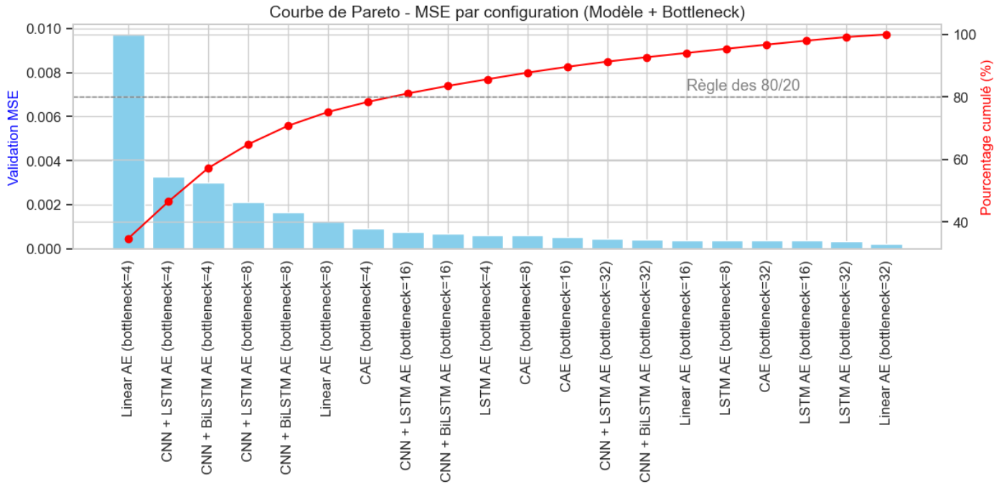

===========================
Methodology & Model Selection
===========================

The architecture of Project Sigma is not a default choice but the result of a **rigorous, multi-stage experimental process**. This process was designed to scientifically validate our core hypotheses and identify the most effective components for each stage of the pipeline.

Our methodology is divided into three key phases: data preparation, model selection, and final validation.

1. Exploratory Data Analysis (EDA) and Preprocessing
-------------------------------------------------------

A deep understanding of the data was fundamental. Our EDA was specifically oriented toward developing a strategy for **short-term anomaly detection**, rather than long-term forecasting.

- **Signal Analysis & Smoothing**:  
  The initial analysis revealed that the ``rail_acceleration`` signal was highly volatile (kurtosis > 17), indicating significant high-frequency noise. A Fast Fourier Transform (FFT) confirmed this. To ensure our models learned meaningful dynamics rather than noise, we applied a **Savitzky-Golay filter**, with its hyperparameters optimized to strike a balance between noise reduction and signal preservation.

- **Dimensionality Estimation via PCA**:  
  Before employing non-linear models, we performed a Principal Component Analysis (PCA) to estimate the intrinsic dimensionality of the time-series windows. The analysis showed that **9 principal components** explained over **90% of the linear variance**, supporting the use of **low-dimensional signatures** (e.g., 8D, 16D) in autoencoder design.

2. Model Selection through Systematic Benchmarking
-----------------------------------------------------

Our core hypothesis is that a **specialized two-stage deep learning pipeline** outperforms generic models. We validated this via a structured benchmarking process.

**Stage 1: Selecting the Optimal Signature Extractor**

We aimed to identify an autoencoder that produced a compact yet expressive signature. Five architectures were benchmarked—Dense AE, CAE, LSTM AE, CNN+LSTM, CNN+BiLSTM—across four bottleneck dimensions (4, 8, 16, 32).

   *Pareto frontier of 20 model configurations: reconstruction MSE vs. model complexity.*

The analysis revealed that the **LSTM Autoencoder with an 8-dimensional bottleneck** offered the best trade-off. It matched the reconstruction quality of larger models (16D, 32D), while producing a signature **4x more compact**—critical for deployment in industrial environments. This model was selected as our primary encoder.

**Stage 2: Optimizing the LSTM Encoder**

After identifying the LSTM AE (8) as the most promising, we used **Optuna**, a Bayesian optimization framework, to fine-tune key hyperparameters (LSTM units, learning rate, batch size). The objective was to minimize the validation reconstruction error.

.. figure:: /_static/optuna_optimization_history.png
   :align: center
   :width: 700px
   :alt: Optuna Optimization History

   *Optimization log from the Optuna study.*

The optimization process led to a significantly improved encoder:

    - Validation MSE Before Optimization: 0.000373  
    - Validation MSE After Optimization:  0.000285  

This represents a **23.6% reduction in reconstruction error**, justifying the optimization step. The final **optimized LSTM AE (8)** was adopted as the definitive Signature Extractor.

**Note on the Processor Model**:  
We also attempted to optimize the CNN-BiLSTM processor model. However, the gains were marginal, confirming that **the quality of the initial signature** is the main determinant of pipeline performance. Hence, efforts were concentrated on optimizing the encoder.

3. Final Validation: Demonstrating the Value of Learned Representations
------------------------------------------------------------------------

To conclude, we validated two key hypotheses:

a) **Learned representations (signatures) outperform raw data**  
b) Our **final deep learning pipeline** surpasses classical industry-standard models

.. figure:: /_static/final_benchmark_violin_plot.png
   :align: center
   :width: 800px
   :alt: Anomaly Score Distribution Benchmark: Raw Data vs. Signatures

   *Comparison of anomaly score distributions. Better models produce narrow peaks near zero and long tails for anomalies.*

Results were unequivocal:  
- Classical models (Isolation Forest, One-Class SVM) trained on our **8D learned signatures** achieved **10–15% better performance** than when trained on **raw 60D data**, validating our representation learning hypothesis.  
- Our **optimized CNN-BiLSTM AE** achieved the most distinct separation between normal and anomalous samples, highlighting its superior modeling capacity.

.. note::

   The full architectural details of the final models are available in :doc:`appendix/model_details`.  
   All source code and experiment notebooks are provided in our `GitHub repository <lien_vers_notebook>`.

The full performance analysis—both qualitative and quantitative—is presented in the **:doc:`results`** section.
