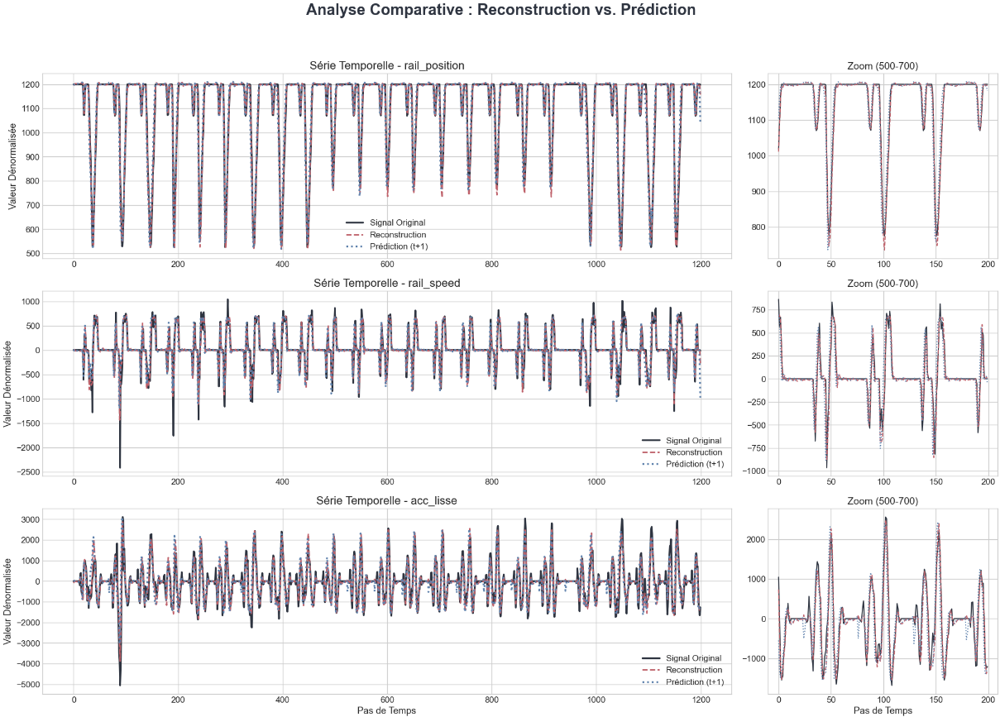

===========================
Results and Performance Analysis
===========================

This section presents the performance of our final, optimized pipeline. To provide a clear and detailed analysis, we focus on a specific case study: the **Vertical Linear Rail**.

The methodology described in the previous section was applied systematically to each component of the industrial cell. The case of the linear rail serves as a representative example of the system's high-fidelity performance.

Case Study: Performance on the Vertical Linear Rail
------------------------------------------------------
.. note::
   This analysis uses the final pipeline: the **LSTM-based Signature Extractor** followed by the **Optuna-optimized CNN Processor Model**.

**Qualitative Analysis: Reconstruction & Prediction**

The following plots compare the original time-series signal with the outputs of our model's two tasks: reconstructing the current state and predicting the state one step into the future.

The model demonstrates high fidelity in both tasks. The reconstructed signal  almost perfectly overlays the original signal. The predicted signal , while slightly less precise as expected, successfully captures the dynamic trends, proving the model's deep understanding of the system's behavior.

**Quantitative Analysis: Performance Metrics**

To quantify this performance, we calculated the Root Mean Squared Error (RMSE) and Mean Absolute Error (MAE) for both tasks on the denormalized test dataset.

.. rst-class:: table-center

   ::

      =============================================================================
      📊 PERFORMANCE REPORT: VERTICAL LINEAR RAIL (Dénormalisé)
      =============================================================================
      Feature              | Tâche              | MAE (Erreur Moyenne) | RMSE
      -----------------------------------------------------------------------------
      rail_position        | Reconstruction     | 8.9435               | 15.5968
                           | Prédiction (t+1)   | 11.6729              | 22.5138
      -----------------------------------------------------------------------------
      rail_speed           | Reconstruction     | 53.8521              | 103.9148  
                           | Prédiction (t+1)   | 62.4520              | 126.5542
      -----------------------------------------------------------------------------
      rail_acceleration    | Reconstruction     | 182.3538             | 274.1707
                           | Prédiction (t+1)   | 234.3421             | 361.0231

Summary of Models for the Entire Industrial Cell
--------------------------------------------------
Following the same rigorous methodology, a specialized model was derived for each component. The table below summarizes the final selected architectures.

.. list-table::
   :widths: 30 35 35
   :header-rows: 1

   * - Industrial Component
     - Selected Signature Extractor
     - Selected Processor Model
   * - **Vertical Linear Rail**
     - LSTM AE (Bottleneck: 8)
     - CNN AE 
   * - **Robot 1 (Depalletizer)**
     - LSTM AE (Bottleneck: 8)
     - Dense AE 
   * - **Robot 2 (Filler)**
     - LSTM AE (Bottleneck: 8)
     - Dense AE 
   * - **Robot 3 (Palletizer Rail)**
     - LSTM AE (Bottleneck: 8)
     - Dense AE 
   * - **Conveyor_Box**
     - -----
     - CNN-BiLSTM AE 
   * - **Conveyor_Bottle**
     - -----
     - CNN-BiLSTM AE

This modular, custom-tailored approach ensures maximum performance for each component while leveraging a consistent and scalable end-to-end pipeline.